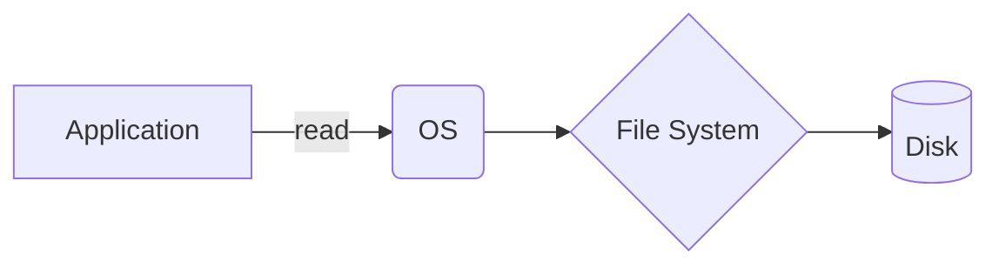

  <small><i>Authored by: Arpit Raj, LNMIIT Jaipur</i></small>
  <h1>📂 File Systems in Detail</h1>
  <h2>Chapter 2</h2>

---

> [!IMPORTANT]
> - A **DBMS** is built on top of a file system.
> - A **file** is a collection of bytes stored on secondary storage and managed by the OS.

## 🛠️ The File System
A file system is a component of the OS responsible for organizing and managing files. Its capabilities include:
- `Create` / `Delete` / `Rename` files
- `Read` / `Write` bytes
- Manage directories / permissions at the file level

### 🌊 Flow of Data

> [!NOTE]
> The **application itself** must parse CSVs, search, update records, and validate data. The OS does **none** of this.

---

## 📝 Text Files

| ✅ PROS | ❌ CONS |
| :--- | :--- |
| • Easy debugging • Portable • Platform independent | • No schema • No indexing • Slow process |

## 📊 CSV Files *(Comma Separated Values)*

| ✅ PROS | ❌ CONS |
| :--- | :--- |
| • Easy import/export • Excel supported | • No indexing • No constraint • No relation • No transaction |

## 📜 JSON Files *(Semi-Structured Data)*

| ✅ PROS | ❌ CONS |
| :--- | :--- |
| • Flexible schema • Easy to exchange over APIs • Supports nested objects | • No transaction • No concurrency • Searching needs scanning • Large dataset is inefficient |

---

## 🥊 File System vs DBMS

| Feature | 📂 File System | 🗄️ DBMS |
| :--- | :---: | :---: |
| **Stores bytes** | ✔️ | ✔️ |
| **Query language** | ❌ | ✔️ |
| **Indexing** | ❌ | ✔️ |
| **Transaction** | ❌ | ✔️ |
| **Concurrency control**| ❌ | ✔️ |
| **Recovery** | ❌ | ✔️ |
| **Integrity** | ❌ | ✔️ |
| **Query optimization** | ❌ | ✔️ |
| **Security** | ❌ | ✔️ |

---

## ⏱️ Sequential Access vs Random Access

| 🛤️ Sequential Access | 🎯 Random Access |
| :--- | :--- |
| • **O(n)** time complexity • Looks for data sequentially (checks all records) • Good for logs, large sequential reads, streaming | • **O(1)** time complexity • Jumps directly to required location using an index/offset • Uses **B+ trees** and **hash indices** |
