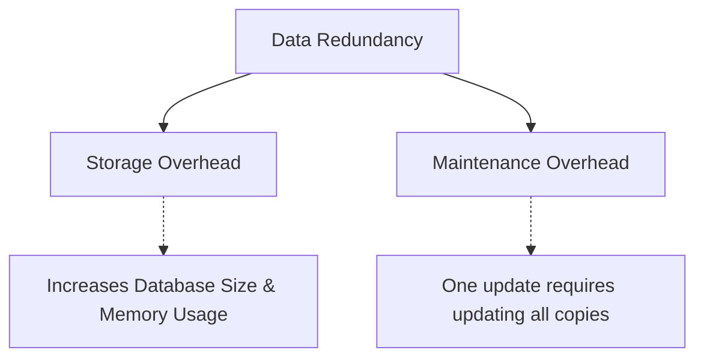

  <small><i>Authored by: Arpit Raj, LNMIIT Jaipur</i></small>
  <h1>⚠️ Problems with File-Based Systems</h1>
  <h2>Chapter 3</h2>

---

### 1️⃣ Data Redundancy
When the same information is stored across multiple storage locations.

### 2️⃣ Data Inconsistency
When multiple copies of the same data contain different values.

| 📇 Eg: `customers.csv` | 📦 `orders.csv` |
| :--- | :--- |
| `9921 Aadz` | `9921 Aadz` |

> [!WARNING]
> **Redundancy** → **Multiple copies** → **Partial update** → **Inconsistency**

### 3️⃣ Data Isolation
Data is scattered across multiple independent files:
- 📄 `student.csv`
- 📄 `hostel.csv`
- 📄 `attendance.csv`

**Goal:** Show all students with `>90%` attendance.
- **In File Systems:** Needs to read every file, parse every record, perform joins manually, and filter results.
- **In DBMS:** Allows you to express this with a simple SQL query, and the optimizer defines an efficient execution strategy.

### 4️⃣ Difficult Data Access
You have to write the search logic yourself, whereas a DBMS handles optimization and execution automatically.

### 5️⃣ Data Integrity Issues
Invalid data is easily allowed in a file system. A DBMS prevents this using constraints (like foreign keys).

### 6️⃣ Atomicity Issues
There is no guarantee that related operations complete as a single unit. A DBMS solves this with **transactions**.

### 7️⃣ Concurrent Access Issues
Without concurrency control, multiple users writing at the same time can corrupt the files.

### 8️⃣ Security Issues
File systems give only **coarse-grained** permissions (typically at the file level).
> [!TIP]
> A DBMS supports **fine-grained** permissions (e.g., column-level or row-level access).

### 9️⃣ Recovery Issues
File systems have no concept of recovery logs or procedures to restore the database to a consistent state in case the server crashes while writing.

---

## 📝 Practice Questions

<b>Q1. Why does data redundancy increase the risk of inconsistency?</b>

 
<b>A1.</b> Data redundancy creates multiple copies of the same logical information. If an update is applied to only some of those copies, they diverge, leading to data inconsistency. Thus, redundancy increases both the likelihood and maintenance cost of keeping data synchronized.

<b>Q2. Explain program-data dependence with an example.</b>

 
<b>A2.</b> Program-data dependence means application logic is tightly coupled to the physical structure of data files. For example, if an application expects a CSV with columns <code>(ID, Name, Age)</code> and the file changes to <code>(ID, Name, DOB)</code>, the parsing logic breaks and the application must be modified. A DBMS reduces this coupling through schema abstraction and data independence.

<b>Q3. Why is data isolation a problem in file-based systems?</b>

 
<b>A3.</b> In file-based systems, related data is scattered across multiple independent files. Applications must manually combine, filter, and maintain relationships between these files, increasing code complexity, reducing maintainability, and making complex queries inefficient.

<b>Q4. What is a lost update? How does it occur?</b>

 
<b>A4.</b> A lost update occurs when two concurrent operations read the same data, modify it independently, and one update overwrites the other. This happens because there is no proper concurrency control to coordinate simultaneous writes.

<b>Q5. Why can't a file system enforce referential integrity?</b>

 
<b>A5.</b> A file system stores bytes and has no understanding of relationships between records. It cannot verify that a <code>CustomerID</code> in one file actually exists in another. Referential integrity requires semantic knowledge of the data, which is provided by a DBMS through foreign key constraints.

<b>Q6. Explain atomicity using a banking example.</b>

 
<b>A6.</b> In a bank transfer, debiting one account and crediting another must be treated as a single transaction. If the system crashes after the debit but before the credit, money appears to disappear. Atomicity guarantees that either both operations succeed or both are rolled back.

<b>Q7. Compare file-level security with database-level security.</b>

 
<b>A7.</b> File systems generally provide coarse-grained permissions at the file or directory level (e.g., read, write, execute). DBMSs support fine-grained authorization, allowing permissions at the database, table, column, and sometimes row level, along with roles, auditing, and privilege management.

<b>Q8. Which DBMS features directly address the major problems of file-based systems?</b>

 
<b>A8.</b>  
• Redundancy → <b>Normalization</b> 
• Inconsistency → <b>Constraints + Transactions</b> 
• Program-Data Dependence → <b>Data Independence</b> 
• Difficult Access → <b>SQL + Query Optimizer</b> 
• Integrity Issues → <b>Primary/Foreign Keys, CHECK Constraints</b> 
• Atomicity Problems → <b>ACID Transactions</b> 
• Concurrency Problems → <b>Locks, MVCC, Isolation Levels</b> 
• Security Problems → <b>Authentication, Authorization, Roles</b> 
• Recovery Problems → <b>Write-Ahead Logging, Checkpoints, Recovery Manager</b>

