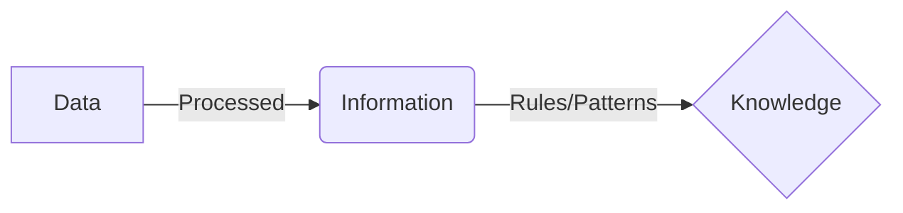

<div align="center">
  <small><i>Authored by: Arpit Raj, LNMIIT Jaipur</i></small>
  <h1>📊 Data & Metadata</h1>
  <h2>Chapter 4</h2>
</div>

---

## 🏗️ Core Concepts

> [!NOTE]
> **Data:** A collection of facts, values, and observations that represent events or attributes but do **not** convey meaning on their own.

**Information:** Processed, organized, and contextualized data which conveys meaning.

*Example:*
| Stud ID | Name | City |
| :--- | :--- | :--- |
| `006` | `Aadz` | `Gwalior` |

**Knowledge:** Information combined with rules, patterns, or interpretations that enables decision-making.



---

## 🏷️ Metadata

> [!IMPORTANT]
> **Metadata:** Basically **data about data**. It provides context about other data.

**Metadata tells us:**
- 📌 What the data means
- 💾 How it's stored
- 🔠 What type it is
- 🚧 Constraints
- 🔗 Relations
- 🔑 Ownership

**Example:**
If you have a row: `ID: 006 | Name: Aadz` *(This is Data)*
**Metadata would be:** Table name, Columns, Primary key, Data types of columns.

> [!TIP]
> Every DBMS maintains metadata describing schemas, tables, columns, indexes, constraints, and permissions. This metadata is stored in the **System Catalog**.

```sql
CREATE TABLE students ... 
-- Defines metadata and structure
```
**Hence:** `[ DBMS = User Data + Metadata ]`

---

## 🧩 Types of Data

| 📦 Structured | 📄 Semi-Structured | 🌊 Unstructured |
| :--- | :--- | :--- |
| • Fixed schema<br>• Rows, columns<br>• SQL friendly<br>• Stored in relational database | • Some organization<br>• Flexible schemas<br>• Diff documents may have diff fields<br>• Stored in MongoDB | • No schema<br>• Stored outside relational DB with metadata stored in DB<br>• *Eg: images, video, PDFs* |

---

## 📝 Practice Questions

<details>
<summary><b>Q1. Differentiate between Data, Information, and Knowledge.</b></summary>
<br>
<b>A1.</b> Data consists of raw facts or values without inherent context (e.g., 21). Information is processed and contextualized data that conveys meaning (e.g., Arpit is 21 years old). Knowledge is information combined with experience or reasoning to support decisions (e.g., recognizing seasonal sales patterns and adjusting inventory).
</details>

<details>
<summary><b>Q2. What is metadata? Give examples stored by a DBMS.</b></summary>
<br>
<b>A2.</b> Metadata is descriptive information about data. It defines the structure, meaning, constraints, and organization of stored data.<br>
Examples include: Table names, Column names, Data types, Primary and foreign keys, Indexes, Constraints, Views, User privileges, Storage information.
</details>

<details>
<summary><b>Q3. Why is metadata necessary for a database?</b></summary>
<br>
<b>A3.</b> Metadata allows the DBMS to understand how data is organized and how it should be interpreted. It enables schema validation, query optimization, constraint enforcement, security, and storage management. Without metadata, the DBMS cannot correctly process user queries.
</details>

<details>
<summary><b>Q4. Differentiate between structured, semi-structured, and unstructured data. Give one example of each.</b></summary>
<br>
<b>A4.</b><br>
- <b>Structured Data:</b> Fixed schema, organized into rows and columns (e.g., an Employees table).<br>
- <b>Semi-Structured Data:</b> Flexible schema with self-describing fields (e.g., JSON documents).<br>
- <b>Unstructured Data:</b> No predefined schema (e.g., images, videos, PDFs).
</details>

<details>
<summary><b>Q5. Why do applications work with logical data instead of physical storage structures?</b></summary>
<br>
<b>A5.</b> Applications interact with logical data because it abstracts away low-level storage details. The DBMS maps logical structures to physical storage, providing physical data independence, improving portability, and allowing storage optimizations without changing application code.
</details>

<details>
<summary><b>Q6. Suppose the DBMS loses all metadata but still has the raw table pages. Can it correctly interpret the stored data? Why or why not?</b></summary>
<br>
<b>A6.</b> No. Without metadata, the DBMS loses the description of the stored bytes. It would not know: Where records begin and end, Column boundaries, Data types, Constraints, Relationships, Index definitions. The raw bytes may still exist on disk, but they cannot be interpreted correctly without the associated metadata. This is why protecting the system catalog (data dictionary) is critical for any DBMS.
</details>
