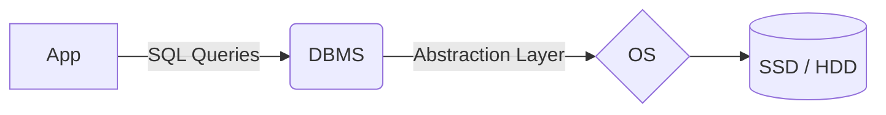

  <small><i>Authored by: Arpit Raj, LNMIIT Jaipur</i></small>
  <h1>🗄️ Database & DBMS Overview</h1>
  <h2>Chapter 5</h2>

---

## 📦 What is a Database?

> [!NOTE]
> **Database:** An organized, logically related collection of data designed to support storage, retrieval, modification, and management of info for one or more applications.

**ORGANIZED • LOGICALLY RELATED • PERSISTENT • SHARED • MANAGED**

### ✨ Characteristics of a Database
- 🔗 **Integrated:** Different pieces of info are interconnected.
- 📏 **Consistent:** Stored data obeys rules.
- 💾 **Persistent:** Data survives even after termination.
- 🔄 **Shared:** Allows concurrent access.
- 🛡️ **Secure:** Proper authorization is maintained.
- 📈 **Scalable:** Doesn't matter how much data volume increases.
- ✂️ **Minimal Redundancy:** Achieved via good schema design.

---

## 🧠 DBMS Overview

A database is simply **data**. On its own, it does **not**:
- ❌ Execute SQL
- ❌ Optimize queries
- ❌ Handle transactions
- ❌ Manage locks
- ❌ Recover from crashes

**All of these are the responsibilities of the DBMS!**

| 📦 Database | 🗄️ DBMS |
| :--- | :--- |
| Collection of related data | Software that manages the database |
| Passive | Active |
| Stores info | Performs operations on info |
| Contains user data | Provides querying, transaction, security, and recovery |

> [!TIP]
> **DBMS:** A software that provides an interface between applications and databases. It enables efficient storage, retrieval, modification, security, transaction processing, concurrency, and recovery.

---

## 🛠️ Responsibilities of a DBMS

**(A) Data Storage**
• Organize records • Manage pages • Allocate storage • Free unused space

**(B) Query Processing**
• Parse SQL • Validate syntax • Check schema • Create execution plan • Execute query

**(C) Query Optimization**
• Estimate cost of each execution plan and execute the one with the lowest cost

**(D) Transaction Management**
• Guarantees ACID properties

**(E) Concurrency Control**
• Prevents lost updates • Prevents dirty reads • Prevents phantom reads

**(F) Recovery Management**
• Write Ahead Logging (WAL) • Checkpoints • Recovery algorithms

**(G) Security Management**
• Authentication • Authorization

**(H) Integrity Enforcement**
• Constraint satisfaction • Unique primary key • Foreign key reference valid row

---

## 🏗️ DBMS Architecture Modules

**A DBMS is not one large program, but a collection of multiple specialized modules.**

| Module | Mapped Responsibility |
| :--- | :--- |
| **Query Processor** | (B, C) Query Processing & Optimization |
| **Storage Manager** | (A) Data Storage |
| **Transaction Manager** | (D) Transaction Management |
| **Buffer Manager** | - |
| **Recovery Manager** | (F) Recovery Management |
| **Authorization Manager**| (G) Security Management |

### 🗃️ Buffer Manager
Accessing a disk is slow, so the DBMS keeps frequently accessed pages in memory.
**It decides:**
- 📥 Which pages to load
- 📤 Which to evict
- ✍️ When modified pages should be written back

> [!IMPORTANT]
> Whenever SQL is executed, the DBMS consults the **System Catalogue** where the metadata is stored.

### 🛤️ Life of a SQL Query

---

## 📝 Practice Questions

<b>Q1: Why is a DBMS considered an abstraction layer between applications and storage?</b>

 
<b>A1:</b> A DBMS abstracts the complexity of physical storage by exposing a logical interface (SQL and schemas) to applications. Applications interact with tables and queries rather than files, pages, or disk blocks. The DBMS translates high-level operations into low-level storage operations, providing data independence.

<b>Q2: Differentiate between a database and a DBMS with examples.</b>

 
<b>A2:</b> A database is the persistent collection of related user data and metadata (e.g., CollegeDB containing Students and Courses tables). A DBMS is the software (e.g., MySQL or PostgreSQL) that manages the database by executing queries, enforcing constraints, handling transactions, controlling concurrency, and recovering from failures.

<b>Q3: List the primary responsibilities of a DBMS.</b>

 
<b>A3:</b> The primary responsibilities of a DBMS include: Data storage management, Query processing, Query optimization, Transaction management, Concurrency control, Recovery management, Security and authorization, Integrity constraint enforcement, and Metadata management.

<b>Q4: What is the role of the Query Processor?</b>

 
<b>A4:</b> The Query Processor parses SQL statements, validates their syntax and semantics, consults the system catalog, generates a logical execution plan, optimizes that plan, and coordinates its execution to produce the requested results.

<b>Q5: Why is a Buffer Manager necessary?</b>

 
<b>A5:</b> Disk access is several orders of magnitude slower than RAM access. The Buffer Manager caches frequently used disk pages in memory, reducing disk I/O and improving query performance. It also decides when modified pages should be flushed back to disk.

<b>Q6: Explain the purpose of the Transaction Manager and the Recovery Manager.</b>

 
<b>A6:</b> The Transaction Manager ensures that groups of operations satisfy the ACID properties by coordinating commits and rollbacks. The Recovery Manager restores the database to a consistent state after failures using logs and recovery algorithms, ensuring durability and consistency.

<b>Q7: What information is stored in the System Catalog (Data Dictionary)?</b>

 
<b>A7:</b> The System Catalog stores metadata, including schemas, table definitions, column definitions, data types, indexes, constraints, views, user accounts, privileges, and optimizer statistics. The DBMS relies on this information to interpret and execute queries correctly.

<b>Q8: Describe the journey of a SQL query from the moment it is submitted until the results are returned.</b>

 
<b>A8:</b> A SQL query passes through several stages: 
1. The DBMS receives the SQL statement. 
2. The Query Processor parses and validates it. 
3. The Optimizer generates and evaluates execution plans. 
4. The chosen plan is executed. 
5. The Storage and Buffer Managers retrieve the necessary data pages. 
6. The DBMS applies constraints and transaction rules as needed. 
7. The requested results are returned to the application.

