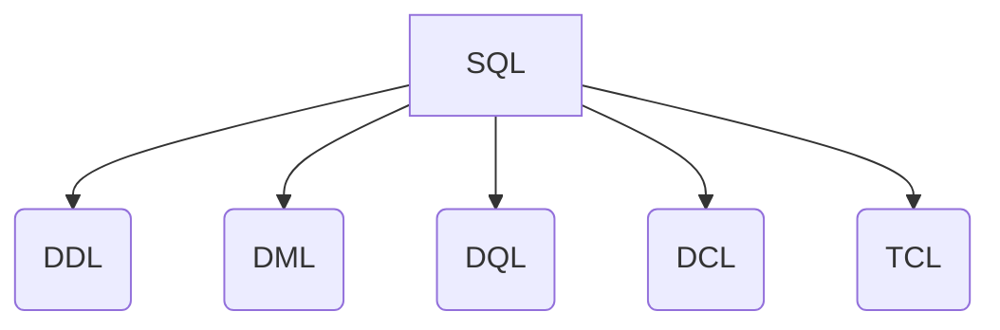

<div align="center">
  <small><i>Authored by: Arpit Raj, LNMIIT Jaipur</i></small>
  <h1>🗣️ Database Languages</h1>
  <h2>Chapter 6</h2>
</div>

---

## 🗂️ Categories of SQL (DDL, DML, DQL, DCL, TCL)

In a database, we perform various operations such as:
- Creating tables and indexes
- Inserting data
- Granting permissions
- Rolling back failed transactions

These are very different operations. Instead of treating them all as one generic type of command, SQL classifies them into **logical groups** called database languages.



---

## 🔍 Logical Classifications

### 1️⃣ DDL → Data Definition Language
Defines and modifies the schema of database objects (database, table, index, schema, view).
> 💡 **Examples:** `CREATE`, `ALTER`, `DROP`, `TRUNCATE`, `RENAME`

> [!NOTE]
> **Internally:**
> - The system catalogue (metadata) is updated.
> - Storage structures are modified.
> - Constraints are registered.
> - *Every DDL operation modifies the system catalog as the schema is changed.*

### 2️⃣ DML → Data Manipulation Language
While DDL manages the *structure*, DML manages the *data inside* that structure.
> 💡 **Examples:** `INSERT`, `UPDATE`, `DELETE`, `MERGE` *(combines insert/update logic)*

> [!NOTE]
> **Internally:**
> - Finds free space.
> - Writes to a new row.
> - Updates indexes.
> - Writes to the transaction log.
> - Checks constraints.

### 3️⃣ DQL → Data Query Language
Retrieves data without modifying it.
> 💡 **Examples:** `SELECT`

> [!NOTE]
> **Internally:**
> Parses SQL → Optimizes Query → Reads Data → Returns Result

### 4️⃣ DCL → Data Control Language
Manages authorization and access controls.
> 💡 **Examples:** `GRANT`, `REVOKE`

### 5️⃣ TCL → Transaction Control Language
Manages database transactions.
> 💡 **Examples:** `COMMIT`, `ROLLBACK`, `SAVEPOINT`, `SET TRANSACTION`

---

## 📝 Practice Questions

<details>
<summary><b>Q1: Differentiate between DDL and DML.</b></summary>
<br>
<b>A1:</b> <b>DDL (Data Definition Language)</b> defines or modifies the database schema by creating, altering, renaming, or dropping database objects. It primarily affects metadata.<br>
<b>DML (Data Manipulation Language)</b> inserts, updates, deletes, or merges rows within existing database objects. It primarily affects user data while leaving the schema unchanged.
</details>

<details>
<summary><b>Q2: Why does CREATE TABLE modify metadata but INSERT does not?</b></summary>
<br>
<b>A2:</b> <code>CREATE TABLE</code> introduces a new database object, requiring the DBMS to update the system catalog with metadata such as the table definition, columns, data types, and constraints.<br>
<code>INSERT</code> adds rows to an existing table. The schema remains unchanged, so metadata generally does not change; only user data and associated indexes/logs are updated.
</details>

<details>
<summary><b>Q3: Explain the purpose of DCL and TCL with examples.</b></summary>
<br>
<b>A3:</b> <b>DCL (Data Control Language)</b> manages permissions and security through commands such as <code>GRANT</code> and <code>REVOKE</code>.<br>
<b>TCL (Transaction Control Language)</b> manages transaction boundaries using commands such as <code>COMMIT</code>, <code>ROLLBACK</code>, and <code>SAVEPOINT</code>, ensuring ACID properties during data modifications.
</details>

<details>
<summary><b>Q4: Is SELECT part of DML or DQL? How would you answer this in an interview?</b></summary>
<br>
<b>A4:</b> There are two accepted conventions:<br>
• Many educational resources classify <code>SELECT</code> as <b>DQL</b> because it retrieves data without modifying it.<br>
• Some SQL standards and DBMS documentation include <code>SELECT</code> under <b>DML</b> because it operates on stored data.<br><br>
<i>In interviews, acknowledge both conventions and explain that the classification depends on the reference being used.</i>
</details>

<details>
<summary><b>Q5: Which DBMS components are primarily involved when executing: CREATE TABLE, INSERT, SELECT, GRANT, COMMIT?</b></summary>
<br>
<b>A5:</b><br>
• <code>CREATE TABLE</code> → Query Processor, Catalog Manager, Storage Manager<br>
• <code>INSERT</code> → Query Processor, Storage Manager, Transaction Manager<br>
• <code>SELECT</code> → Query Processor, Query Optimizer, Buffer Manager<br>
• <code>GRANT</code> → Authorization Manager<br>
• <code>COMMIT</code> → Transaction Manager, Recovery Manager
</details>

<details>
<summary><b>Q6: Classify the following statements and describe their primary effect on the database.</b></summary>
<br>

```sql
CREATE TABLE Employees (...)
INSERT INTO Employees VALUES (...)
GRANT SELECT ON Employees TO analyst
COMMIT
```

<b>A6:</b><br>
• <b>CREATE TABLE</b> — <b>DDL</b>. Creates a new table and updates the system catalog (metadata).<br>
• <b>INSERT INTO</b> — <b>DML</b>. Adds a new row to the table and updates indexes and transaction logs.<br>
• <b>GRANT SELECT</b> — <b>DCL</b>. Grants read permission on the table to the specified user or role.<br>
• <b>COMMIT</b> — <b>TCL</b>. Permanently commits all changes made in the current transaction.
</details>
