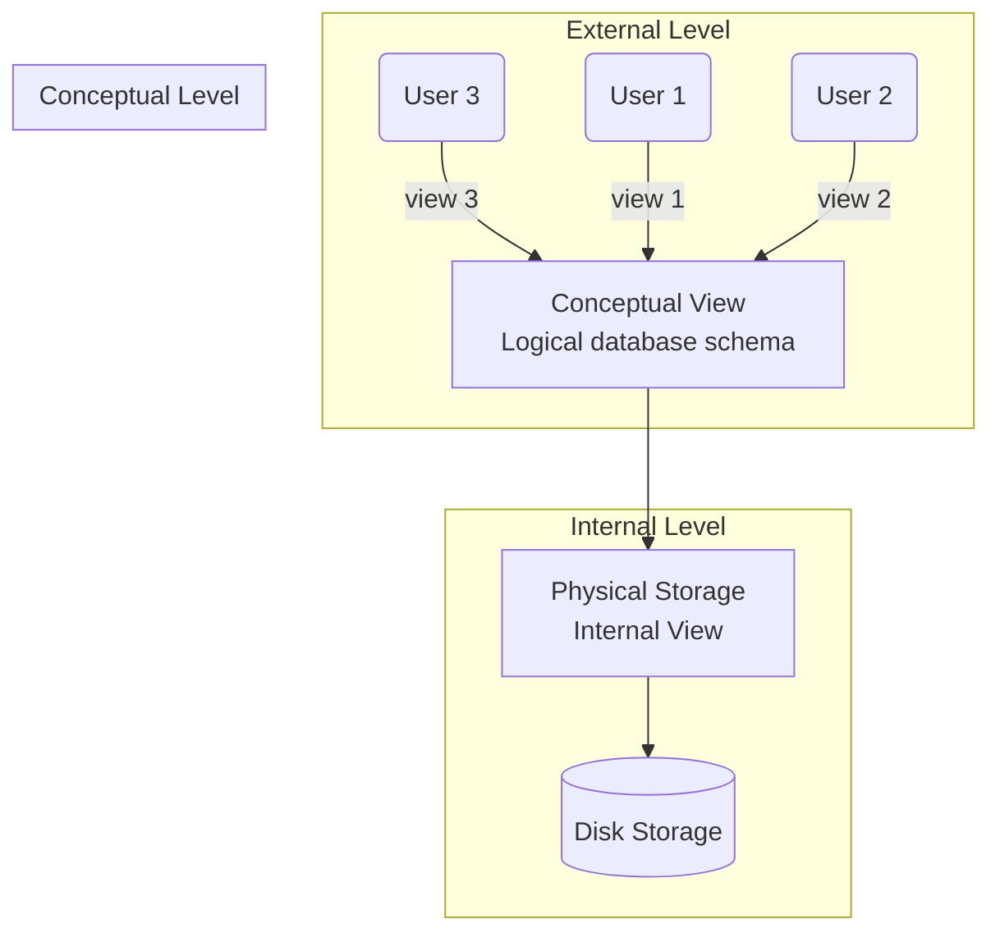

<div align="center">
  <small><i>Authored by: Arpit Raj, LNMIIT Jaipur</i></small>
  <h1>🏗️ Data Abstraction & 3-Schema Architecture</h1>
  <h2>Chapter 7</h2>
</div>

---

## 🎭 Data Abstraction

> [!NOTE]
> **Data Abstraction** is the process of hiding unnecessary details of data storage (like which block stores a record, which page contains it, which index, which file offset occupies it, B+ tree or heap file).

It exposes only the information required by different categories of users.

---

## 🏛️ ANSI-SPARC 3-Schema Architecture

Different users need different views of the database.

> **Example:**
> - **Aadz** may need to see just her CGPA and courses.
> - A **Professor** may need to see attendance and marks.
> - An **Administrator** may need to see indexes, storage, users, and backups.
> - A **Developer** may need to see pages, blocks, and disk layout.



### Breakdown of the 3 Levels:

1. 👁️ **External View:** Multiple user-specific views expose only the required subset of the database.
2. 🧠 **Conceptual View:** The complete logical structure of the database. Defines tables, columns, relations, constraints, keys, and data types.
3. ⚙️ **Internal View:** How the database is physically stored on secondary storage. Involves pages, blocks, B-trees, hash indexes, and buffer pools.

### Data Retrieval Process Flow:
1. Read external view
2. Map to conceptual schema
3. Map to physical storage
4. Retrieve data
5. Convert back to rows

---

## 🔓 Data Independence

> [!IMPORTANT]
> **Data Independence** is the ability to change or modify one level of the database schema without changing any higher level.

### 1️⃣ Physical Data Independence
The ability to change the **internal schema** without changing the **conceptual schema**.

> **Example:** Changing a Heap file to a B+ Tree Index.
> - SQL didn't change, no application changed.
> - You can change the storage structure, indexing strategy, and file organization without affecting the database schema.

### 2️⃣ Logical Data Independence
The ability to modify the **conceptual schema** without affecting the **external view**.
*(Harder to achieve as logical changes or applications depend directly on schemas)*

**Example of Logical Dependency:**

| ID | Name | CG |
| :--- | :--- | :--- |
| `006` | `Aadz togi` | `7.9` |
| `011` | `Arpit Raj` | `7.7` |

```sql
SELECT NAME FROM STUDENTS WHERE ID = 006;
```

**Now suppose the schema is changed:**
| ID | Fname | Lname | cg |
| :--- | :--- | :--- | :--- |
| `006` | `Aadz` | `togi` | `7.9` |
| `011` | `Arpit` | `Raj` | `7.7` |

```sql
SELECT NAME FROM STUDENTS; -- ❌ ERROR!
```
> [!WARNING]
> The application is dependent on the logical schema. Now every application has to be modified which is very expensive!

**Solution using Logical Data Independence (Views):**
```sql
CREATE VIEW student_view AS
SELECT
 studentID,
 CONCAT(FirstName, ' ', LastName) AS NAME,
 CGPA
FROM Students;
```

---

## 🌟 Importance of Data Abstraction

Without abstraction, every storage change would need the application to be rewritten. 
Hence, with abstraction we get:
- 🛠️ **Maintainability**
- 📦 **Portability**
- 📈 **Scalability**

---

## 📝 Practice Questions

<details>
<summary><b>Q1. What is data abstraction? Why is it necessary?</b></summary>
<br>
<b>A1.</b> Data abstraction is the process of hiding low-level implementation details while exposing only the information required by users. It simplifies application development, improves security, enables storage optimizations, and provides data independence.
</details>

<details>
<summary><b>Q2. Explain the ANSI-SPARC Three-Schema Architecture.</b></summary>
<br>
<b>A2.</b> The ANSI-SPARC Three-Schema Architecture divides the database into three abstraction levels:<br>
• <b>External Level:</b> Multiple user-specific views of the database.<br>
• <b>Conceptual Level:</b> The complete logical schema describing entities, relationships, and constraints.<br>
• <b>Internal Level:</b> The physical storage representation, including pages, indexes, and file organization.<br>
Mappings between these levels allow changes at one level with minimal impact on others.
</details>

<details>
<summary><b>Q3. Differentiate between the external, conceptual, and internal levels with examples.</b></summary>
<br>
<b>A3.</b><br>
• <b>External Level:</b> HR sees employee salaries; employees see only their own profiles.<br>
• <b>Conceptual Level:</b> Defines tables such as <code>Employees(ID, Name, Salary)</code> and their relationships.<br>
• <b>Internal Level:</b> Specifies how those tables are stored using pages, indexes, and record layouts on disk.
</details>

<details>
<summary><b>Q4. What is data independence? Why is it important?</b></summary>
<br>
<b>A4.</b> Data independence is the ability to modify one schema level without affecting higher levels. It reduces maintenance costs, allows performance optimizations, and isolates application code from storage or schema changes.
</details>

<details>
<summary><b>Q5. Differentiate between logical and physical data independence. Give two examples of each.</b></summary>
<br>
<b>A5.</b><br>
<b>Physical Data Independence</b><br>
• Change from heap files to B+ Tree storage.<br>
• Add or remove indexes.<br>
• Move data to faster storage devices.<br><br>
<b>Logical Data Independence</b><br>
• Split a <code>Name</code> column into <code>FirstName</code> and <code>LastName</code>.<br>
• Introduce a new table while preserving existing views.<br><br>
<i>Note: Physical data independence is generally easier to achieve than logical data independence.</i>
</details>

<details>
<summary><b>Q6. Suppose a DBA creates a new B+ Tree index on the StudentID column. Which level changes? Will applications need to be modified? Why?</b></summary>
<br>
<b>A6.</b> Creating a B+ Tree index changes the internal schema. This is an example of physical data independence. Applications do not need modification because the logical schema and SQL interface remain unchanged.
</details>

<details>
<summary><b>Q7. Suppose a table is redesigned by splitting the Name column into FirstName and LastName. Which type of data independence is involved? Is it easier or harder to preserve application compatibility?</b></summary>
<br>
<b>A7.</b> Splitting <code>Name</code> into <code>FirstName</code> and <code>LastName</code> is a conceptual schema change, so it relates to logical data independence. Preserving compatibility is harder because application queries may reference the original column unless compatibility views or other mechanisms are provided.
</details>
