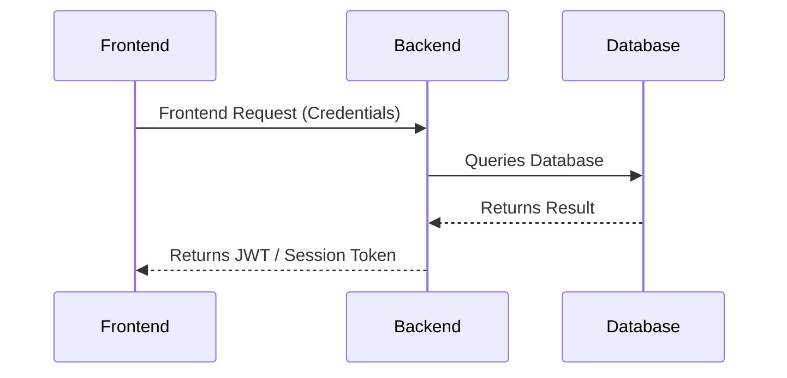
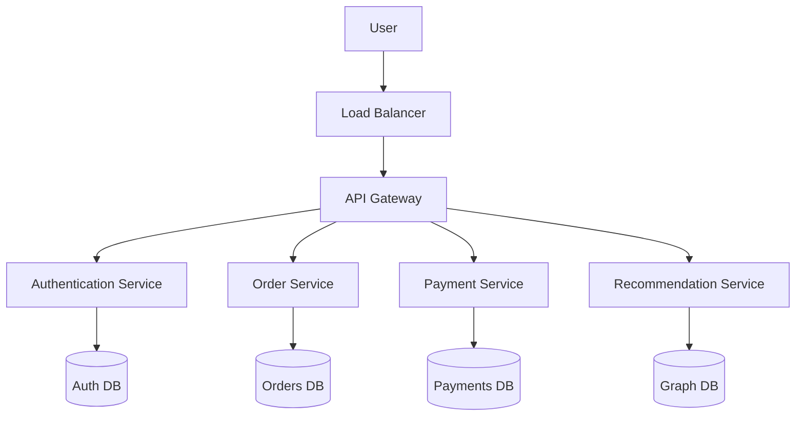

  <small><i>Authored by: Arpit Raj, LNMIIT Jaipur</i></small>
  <h1>🌐 Database Architecture</h1>
  <h2>Chapter 8</h2>

---

> [!NOTE]
> **Database Architecture** describes how users, applications, business logic, and databases communicate with each other in a DBMS.

## 1️⃣ 1-Tier Architecture
- User, application, and database all exist on the **same machine**.
- Everything runs locally.
- **Examples:** SQLite, Local MySQL, personal projects.

---

## 2️⃣ 2-Tier Architecture
- Consists of a **client application** and a **database server**.
- Multiple users have access to a centralized database.
- **Examples:** Desktop banking applications, C# desktop + SQL server, legacy enterprise desktop software.

> [!WARNING]
> **Drawback:** Easy maintenance on the server, however, **business logic is stored inside every client**. If a bug is found, you need to update all client computers!

---

## 3️⃣ 3-Tier Architecture

Introduces a middle layer for business logic.

1. 🎨 **Presentation Layer:** Handles the UI (HTML, CSS, React, Android, iOS).
2. ⚙️ **Business Logic Layer:** Handles authentication, authorization, validation, APIs, and business rules. This is basically the backend (e.g., Express.JS, Springboot, Django, ASP.NET).
3. 🗄️ **Database Layer:** Stores the tables, indexes, transactions, and constraints.

**Flow of a Request:**

### ⚖️ Pros & Cons of 3-Tier
| ✅ PROS | ❌ CONS |
| :--- | :--- |
| • Scalable • Secure • Centralized business logic • Easy maintenance • Better caching | • More servers • High cost • Complex • Additional network latency |

---

## 🚀 N-Tier Architecture (Microservices)

Modern production systems instead of having one monolithic backend, have many **specialized services** and each service often has its own database and backend.

An N-Tier architecture introduces multiple intermediate services, each with a specific responsibility.

### ⚖️ Pros & Cons of N-Tier

**✅ PROS (Hence...)**
- Each service can scale independently
- Fault isolation
- Independent deployment
- Better maintenance

**❌ CONS**
- Distributed transactions are very difficult
- Network latency
- Extremely complex
- Harder debugging

---

## 🏢 Industry Architectures

### 🚀 Startups (Simple 3-Tier)
`React` ➔ `Spring Boot / Express` ➔ `SQL (PostgreSQL)`

### 🏢 Medium Companies (3-Tier with supporting infra)
`React` ➔ `Backend` ➔ `Redis (Cache)` ➔ `PostgreSQL`

### 🌐 FAANG (N-Tier Architecture)
- We can't connect the frontend directly to the database because of credential leaks, business logic bypasses, and security risks.
- Each microservice has its own database such that it enables independent deployment, independent scaling, and fault isolation.
- The major tradeoff is **complexity in maintaining consistency**.

---

## 📝 Practice Questions

<b>Q1. Define database architecture. Why do different architectures exist?</b>

 
<b>A1.</b> Database architecture describes how users, applications, business logic, and databases interact within a system. Different architectures exist because application requirements evolve with scale, security, maintainability, and performance needs.

<b>Q2. Differentiate between 1-tier, 2-tier, 3-tier, and N-tier architectures.</b>

 
<b>A2.</b> 
• <b>1-tier:</b> UI, application logic, and database on one machine. 
• <b>2-tier:</b> Client communicates directly with a remote database server. 
• <b>3-tier:</b> Client communicates with an application server, which interacts with the database. 
• <b>N-tier:</b> Multiple intermediate services (API gateways, authentication, microservices, caches, etc.) coordinate before accessing one or more databases.

<b>Q3. Why is 3-tier architecture preferred for modern web applications?</b>

 
<b>A3.</b> A 3-tier architecture separates presentation, business logic, and data storage. This improves security, maintainability, scalability, and allows business rules to be centralized on the application server rather than duplicated across clients.

<b>Q4. Why should clients not communicate directly with the database in production systems?</b>

 
<b>A4.</b> Direct database access from clients exposes credentials, bypasses business logic and validation, complicates authorization, increases attack surface, and places unnecessary load on the database. An application server mediates access and enforces business rules.

<b>Q5. Explain the architecture of a Flipkart login request from the user's browser to the database.</b>

 
<b>A5.</b> 
1. The browser sends login credentials to the backend. 
2. The backend validates the request and authenticates the user. 
3. The backend queries the database for user information. 
4. The database returns the result. 
5. The backend generates a session or JWT. 
6. The response is returned to the browser. 
<i>The browser never directly communicates with the database.</i>

<b>Q6. Why do large-scale systems often use N-tier architectures instead of a simple 3-tier model?</b>

 
<b>A6.</b> Large systems use N-tier architectures because responsibilities can be divided into specialized services that scale independently, fail independently, and can be deployed separately. Although this introduces distributed systems challenges, it greatly improves scalability and maintainability for high-traffic applications.

