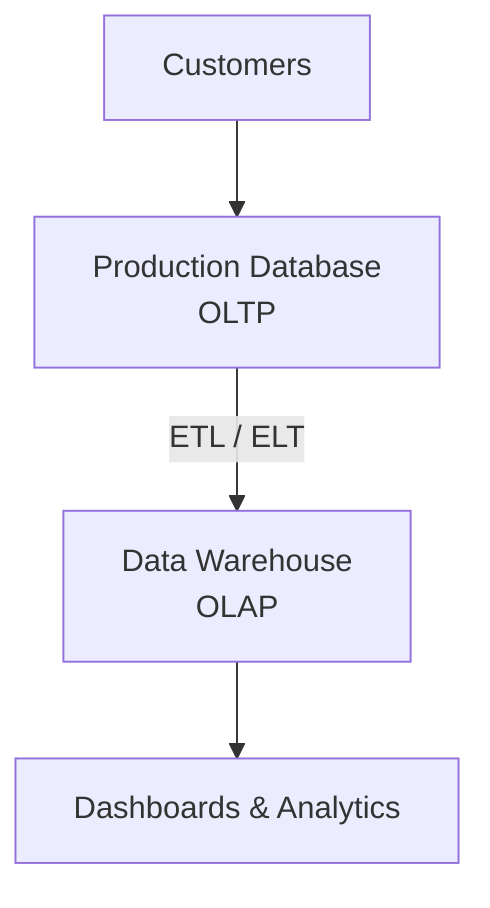

<div align="center">
  <small><i>Authored by: Arpit Raj, LNMIIT Jaipur</i></small>
  <h1>🔄 OLTP VS OLAP</h1>
  <h2>Chapter 11</h2>
</div>

---

## ⚡ OLTP (Online Transaction Processing)

> [!NOTE]
> **OLTP systems** are optimized for executing large numbers of small, fast, concurrent transactions while maintaining data integrity through ACID properties.

Every second, a user performs operations such as:
`login` → `search product` → `add to cart` → `place order`
*(Each operation involves a few rows only and must complete quickly)*

### Characteristics of OLTP:
- 📈 Millions of transactions
- ⏱️ Short running queries
- ✍️ Intensive read/write
- 🛤️ High concurrency
- ⚡ Low latency
- 🛡️ ACID compliant
- 📐 Normalized schema

**Example:** ATM withdraw, UPI payment, Rapido booking

---

## 📊 OLAP (Online Analytical Processing)

> [!NOTE]
> **OLAP systems** are optimized for complex analytical queries over large volumes of historical data. Instead of processing individual transactions, patterns are analyzed.

**Example Query:**
```sql
SELECT State, Category, SUM(SALES)
FROM Orders
GROUP BY STATE, Category;
```
> [!WARNING]
> This query may scan **millions of rows**!

### Characteristics of OLAP:
- ⏳ Long running queries
- 📖 Read heavy
- 📚 Historical data
- 📉 For reporting
- ❄️ Star / Snowflake schema is common

**Example:** Revenue dashboard, customer segmentation, recommendation engines, quarterly reports

---

## ⚖️ Why We Can't Use One Database

Companies use multiple databases, each optimized for a specific workload (transactional, analytical, caching, search, etc.).

**OLTP**  vs  **OLAP**

> [!IMPORTANT]
> Let's say we have 10,000 purchases per minute on our production database. Now someone runs a complex analytical query over historical data. It causes:
> - ⚠️ CPU usage spikes
> - ⚠️ Memory usage increases
> - ⚠️ Customer transactions slow down, and they can't place orders smoothly!

### Solution: Separate Systems (Data Warehouse)



> [!TIP]
> **Data Warehouse:** A centralized repository that stores integrated, analyzed, historical data optimized for reporting and decision making.

### OLTP to Warehouse Pipeline
→ Done via **ETL** (Extract, Transform, Load)

1. **Extract:** Copies the data from relevant fields (e.g., Orders, Customers, Inventory).
2. **Transform:** Cleans and prepares the data.
   - Remove duplicates
   - Standardize dates
   - Currency conversion
   - Eliminate inconsistent data
   - Join related datasets
3. **Load:** Stores transformed data in the warehouse.

| Schema | Purpose |
| :--- | :--- |
| **OLTP** | Uses *normalized* schemas to minimize redundancy and ensure consistency during updates. Related fields are linked by foreign keys. |
| **OLAP** | Uses *denormalized* schemas like star or snowflake to reduce joins and improve query performance. |

---

### Tech Stack Examples
- **OLTP** → PostgreSQL, MySQL
- **OLAP** → Snowflake, Google BigQuery

---

## 📝 Practice Questions

<details>
<summary><b>Q1. What is the primary goal of an OLTP system? Give three real-world examples.</b></summary>
<br>
<b>A1.</b> An OLTP system processes high volumes of short, concurrent transactions while maintaining ACID properties. Examples include placing an Amazon order, withdrawing cash from an ATM, and completing a UPI payment.
</details>

<details>
<summary><b>Q2. What is OLAP? How does it differ from OLTP?</b></summary>
<br>
<b>A2.</b> OLAP systems are designed for analyzing large amounts of historical data using complex queries and aggregations. In contrast, OLTP systems process day-to-day transactional operations with low latency and high concurrency.
</details>

<details>
<summary><b>Q3. Why is it a bad idea to run large analytical queries on a production OLTP database?</b></summary>
<br>
<b>A3.</b> Analytical queries often scan millions or billions of rows, consuming CPU, memory, and I/O resources. Running them on a production OLTP database can slow down or disrupt customer-facing transactions.
</details>

<details>
<summary><b>Q4. What is a data warehouse, and why do organizations use one?</b></summary>
<br>
<b>A4.</b> A data warehouse is a centralized repository optimized for storing historical, integrated data used for reporting, analytics, and business intelligence. It separates analytical workloads from transactional systems to improve overall performance.
</details>

<details>
<summary><b>Q5. Explain the ETL process.</b></summary>
<br>
<b>A5.</b> ETL stands for Extract, Transform, Load. Data is extracted from operational systems, transformed by cleaning and standardizing it, and then loaded into a data warehouse for analytical use.
</details>

<details>
<summary><b>Q6. A CFO asks for a report showing monthly revenue by product category over the last five years. Should this query run on the OLTP database or the data warehouse? Explain your reasoning.</b></summary>
<br>
<b>A6.</b> The query should run on the data warehouse (OLAP system) because it involves historical data, aggregations, and reporting across a long time period. Running it on the OLTP database could negatively affect transactional performance.
</details>
