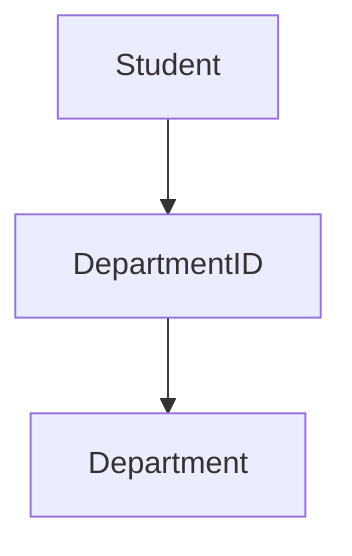

<div align="center">
  <small><i>Authored by: Arpit Raj, LNMIIT Jaipur</i></small>
  <h1>🌐 What is the Relational Model?</h1>
  <h2>Chapter 14</h2>
</div>

---

### Definition

> [!NOTE]
> The **Relational Model** is a logical model for organizing data into relations (tables) and defining relationships between them using mathematical principles from set theory.

### Example:

**Students Table:**
| StudentID | Name | DepartmentID |
| :--- | :--- | :--- |
| `101` | `Aadz` | `10` |
| `102` | `Arpit` | `20` |

**Departments Table:**
| DepartmentID | DepartmentName |
| :--- | :--- |
| `10` | `CSE` |
| `20` | `ECE` |

**The relationship is:**


---

## 🛑 3. The Problems with Older Database Models

### A. Hierarchical Database Model

```text
Company
│
├── HR
│   ├── Employee A
│   └── Employee B
│
└── Engineering
    ├── Employee C
    └── Employee D
```
> [!WARNING]
> Each child had **one parent node**. Now what if Employee C works for both HR and Engineering? This leads to data redundancy, since two parents were not allowed in hierarchical databases.

### B. Network Database Model

To solve that, network databases allowed **Multiple parents**.

```text
       Aadz
      /    \
Software   VLSI 
Engineer   Engineer
```

> [!WARNING]
> Although more flexible, they became extremely complicated.
> Applications had to know:
> 1. Where data was stored
> 2. Which path to follow
> 
> Developers spent significant effort just navigating data!

---

## 🧮 The Relational Model (Set Theory & Logic)

The relational model is primarily based on:
1. **Set Theory**
2. **First-Order Predicate Logic**

### A. Set Theory

A set is:
> An **unordered collection of distinct elements**.

**Example:** `{1, 2, 3, 4}`

> [!IMPORTANT]
> **Notice:**
> - No duplicates allowed.
> - No ordering requirement.

*Although SQL implementations allow duplicate rows unless you explicitly remove them, the original relational model treats a relation as a strictly mathematical set of tuples.*

### B. Predicate Logic

Predicate logic allows statements like:
`Student CGPA > 9`

**SQL Equivalent:**
```sql
SELECT *
FROM Students
WHERE CGPA > 9;
```

The `WHERE` clause is essentially expressing a logical predicate that each row must satisfy. Predicate logic allows you to model complex real-world facts that cannot be expressed using simple true/false sentences. Its foundational elements include: 
- **Predicates:** The properties or relations of objects. For example, in the statement "x is a prime number", "x" is the object and "...is a prime number" is the predicate, often denoted as P(x).

---

> [!WARNING]
> **Relational Database = Database with relationships?**
> **Wrong.** 
> The word "relation" is a mathematical term from set theory. A relation is a set of tuples sharing the same attributes.

---

## 🌟 10. Advantages of the Relational Model

1. 🧱 **Simple Structure**
   Everything is represented using tables. Easy to understand.
2. 🔓 **Data Independence**
   Applications focus on *what* data they need. The DBMS decides *how* to retrieve it.
3. ✂️ **Reduced Redundancy**
   Supports normalization, which minimizes unnecessary duplication.
4. 🛡️ **High Data Integrity**
   Constraints help ensure valid data.
   *(Examples: Primary Key, Foreign Key, CHECK, UNIQUE)*
5. 🔍 **Powerful Query Language**
   SQL enables complex queries without requiring developers to manually navigate data structures.

---

## 📉 Limitations of the Relational Model

*No technology is perfect.*

1. 📌 **Fixed Schema**
   Changing table structures requires careful planning and migrations.
2. 📦 **Complex Object Storage**
   Nested JSON, graphs, and deeply hierarchical structures are often less natural than in specialized databases.
3. ⚖️ **Horizontal Scaling**
   Scaling relational databases across many machines is generally more challenging than scaling some NoSQL systems.
4. 🔗 **Joins Can Become Expensive**
   Large joins across massive datasets may require significant computation, especially without proper indexing.

> [!TIP]
> Despite these limitations, Relational Databases remain the backbone of banking, finance, healthcare, ERP systems, and much of modern backend infrastructure.
