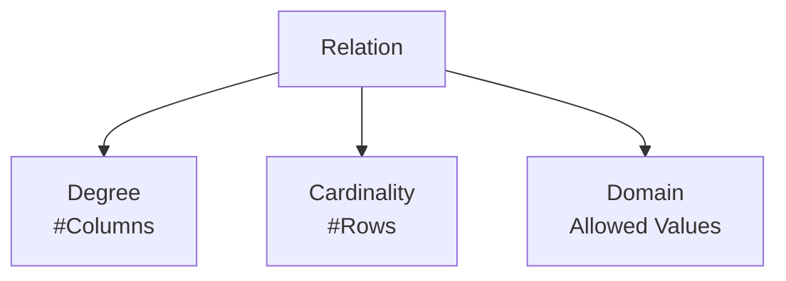

  <small><i>Authored by: Arpit Raj, LNMIIT Jaipur</i></small>
  <h1>📐 Characteristics of a Relation</h1>
  <h2>Chapter 17</h2>

---

Every relation has three important characteristics:

> [!IMPORTANT]
> **Remember this forever:**
> - **Degree** → Columns
> - **Cardinality** → Rows
> - **Domain** → Allowed values for a column

---

## 🔢 What is Degree?

**Definition:**
The degree of a relation is the total number of attributes (columns) present in the relation.

**Degree tells us:**
- The structure of the relation
- The amount of information recorded per tuple
- Whether the schema has changed

*It is part of the schema, not the data.*

---

## 📊 What is Cardinality?

**Definition:**
The cardinality of a relation is the total number of tuples (rows) present in the relation at a given time.

> [!WARNING]
> **THE BIGGEST INTERVIEW TRAP**
> There are two different meanings of cardinality in DBMS!
> 
> **Meaning 1 — Relation Cardinality**
> *(This chapter)*
> **Definition:** Number of rows.
> 
> **Meaning 2 — ER Diagram Cardinality**
> *(Used in ER modeling)*
> **Examples:** `1:1`, `1:N`, `N:M`
> This describes how entities relate to each other, not how many rows are in a table.

---

## 🎯 What is a Domain?

This is one of the most important theoretical concepts.

**Definition:**
A domain is the set of all permissible (allowed) values that an attribute can take.

> [!NOTE]
> - **Relation cardinality** refers to the number of tuples in a relation. **ER cardinality** refers to the relationship multiplicity between entities, such as 1:1, 1:N, or M:N.
> - A **data type** defines the representation (e.g., `INT`, `VARCHAR`), while a **domain** defines the valid set of values for an attribute.
