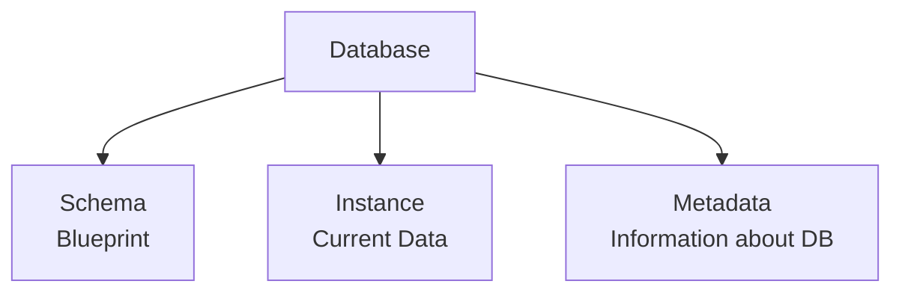

<div align="center">
  <small><i>Authored by: Arpit Raj, LNMIIT Jaipur</i></small>
  <h1>📜 Database Core Concepts (Schema & Instance)</h1>
  <h2>Chapter 18</h2>
</div>

---

Every database has three important things:



**Think of them as:**
- **Schema** → Design
- **Instance** → Current State
- **Metadata** → Description of the Design

---

## 🏛️ Schema

> [!NOTE]
> A **database schema** is the logical structure or blueprint of a database that defines how data is organized, including tables, attributes, relationships, constraints, and other database objects.

**A schema defines:**
- Tables
- Columns
- Data types
- Constraints
- Relationships
- Views
- Indexes

**Suppose we execute:**
```sql
ALTER TABLE Students
ADD Email VARCHAR(100); 
```
*The schema has changed.*

> [!WARNING]
> **Changing schemas requires:**
> - Planning
> - Testing
> - Migrations
> - Application updates
> 
> Therefore, schema changes happen much **less frequently** than data changes. This is why we say the schema is *relatively static, not absolutely static*.

---

## 📸 Instance

> [!NOTE]
> A **database instance** is the collection of data stored in the database at a particular point in time.

Every insert, update, or delete creates a new database instance.

---

## 📚 Metadata & Data Dictionary

**Metadata** is data that describes other data. Simple.
It doesn't store your actual business data. Instead, it stores information *about* the database.

> [!TIP]
> A **data dictionary** is a repository that stores metadata about the database.

**It contains:**
- Table definitions
- Column definitions
- Constraints
- Keys
- Data types
- Relationships
- Permissions
- Views
- Index definitions

---

## 🗃️ System Catalogue

> [!WARNING]
> **System catalogue:** Many confuse it with the data dictionary!

**Definition:**
The **system catalog** is the DBMS-maintained collection of system tables that stores metadata about all database objects. The system catalog *stores* the data dictionary (metadata).

### Where Is Metadata Stored?
Metadata is stored by the DBMS inside the system catalog (or catalog tables), which together form the data dictionary. 

The system catalog is the DBMS-maintained collection of system tables that stores metadata. It is the **physical implementation** through which the DBMS maintains the data dictionary.
