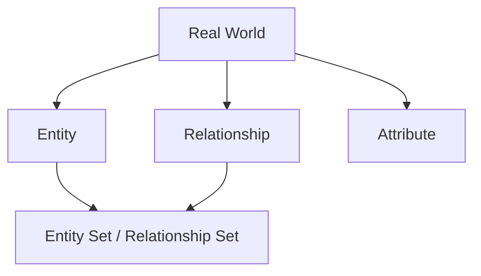
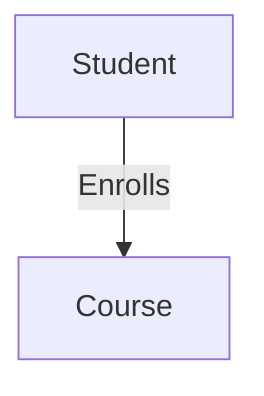

  <small><i>Authored by: Arpit Raj, LNMIIT Jaipur</i></small>
  <h1>📐 ER Model Notes</h1>
  <h2>Chapter 21</h2>

---

Everything in an ER model revolves around four core concepts.

### 🧠 Think of it like this:

- **Entity** → Object
- **Attribute** → Property of the object
- **Relationship** → Connection between objects
- **Entity Set** → Collection of similar objects

---

## 🏗️ What is an Entity?

**Definition:**
An Entity is a distinguishable real-world object that has an independent existence and about which information is stored in the database. An entity must be uniquely identifiable.

### Characteristics of an Entity
A good entity:
- ✅ Exists independently
- ✅ Has attributes
- ✅ Can be uniquely identified
- ✅ Represents a real-world object

---

## 🗃️ What is an Entity Set?

**Definition:**
An Entity Set is a collection of entities of the same type that share the same attributes.

> [!NOTE]
> **Example: Student Entity Set**
> 
> **Student Contains:**
> • Aadz
> • Arpit
> 
> **Every one of them has:**
> • Roll Number
> • Name
> • CGPA
> 
> *They share the exact same attributes.*

---

## 🤝 What is a Relationship?

**Definition:**
A Relationship is an association between two or more entities.

- `Student` and `Course` are **entities**.
- `Enrolls` is the **relationship**.

---

## 🕸️ Relationship Set

**Definition:**
A Relationship Set is the collection of all relationships of the same type between entity sets.

### Example

| Student | Course |
| :--- | :--- |
| `Aadz` | `VLSI` |
| `Aadz` | `MWE` |
| `Arpit` | `VLSI` |

**Relationships:**
- `Aadz` → `VLSI`
- `Aadz` → `MWE`
- `Arpit` → `VLSI`

> [!TIP]
> All of these individual `"Enrolls"` relationships together form the **Relationship Set**.
