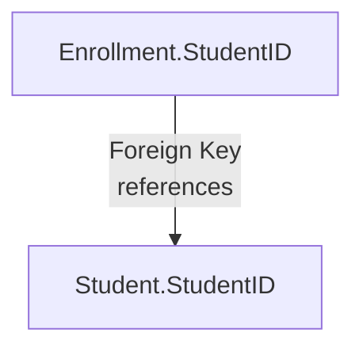

<div align="center">
  <small><i>Authored by: Arpit Raj, LNMIIT Jaipur</i></small>
  <h1>🔗 Foreign Key (FK)</h1>
  <h2>Chapter 26</h2>
</div>

---

## 🧐 What is a Foreign Key?

> [!NOTE]
> A **Foreign Key (FK)** is an attribute (or a set of attributes) in one table that refers to the Primary Key (or another unique key) of another table.

**Foreign keys:**
- Connect tables
- Enforce relationships
- Prevent invalid data *(Referential Integrity)*
- Maintain consistency

> [!IMPORTANT]
> The FK must be equal to a valid PK value in the referenced table, or it can be `NULL` (if allowed). Foreign Keys ensure that related tables remain synchronized.

---

## 🚧 Foreign Key Constraints & Actions

When a parent row is deleted or updated, what should happen to the child rows? 

### 1️⃣ CASCADE
**`ON DELETE CASCADE`**
When a parent row is deleted, all matching child rows are automatically deleted.

**`ON UPDATE CASCADE`**
Suppose `StudentID` changes from `101` → `201`.
The database automatically updates all Foreign Keys referencing it.

### 2️⃣ RESTRICT (or NO ACTION)
*This is the safest option.*
If child rows exist, the parent row **cannot** be deleted (or updated, depending on the constraint).

### 3️⃣ SET NULL
When the parent row is deleted, the Foreign Key value in the child rows becomes `NULL`.

### 4️⃣ SET DEFAULT
When the parent row is deleted, the Foreign Key is set to a predefined default value.

---

## 📝 Example 1 — Student and Course

**Student (Parent Table)**
| StudentID | Name |
| :--- | :--- |
| `101` | `Arpit` |
| `102` | `Aadz` |

**Enrollment (Child Table)**
| EnrollmentID | StudentID | Course |
| :--- | :--- | :--- |
| `1` | `101` | `DBMS` |
| `2` | `102` | `OS` |



### Creating Parent Table
```sql
CREATE TABLE Student
(
 StudentID INT PRIMARY KEY,
 Name VARCHAR(50)
);
```

### Creating Child Table
```sql
CREATE TABLE Fees
(
 ReceiptID INT PRIMARY KEY,
 StudentID INT,
 FOREIGN KEY(StudentID) REFERENCES Student(StudentID)
);
```

---

## 🧠 Important Concepts

### ❓ Can a Foreign Key Contain NULL?
**Yes.**
A Foreign Key may contain `NULL`, provided the column is defined to allow NULL values.
`NULL` usually means: *"This row is currently not related to any parent row."*

### ❓ Can a Table Have Multiple Foreign Keys?
**Yes.**
*Example:* `Order` Table
| OrderID | CustomerID | EmployeeID |
| :--- | :--- | :--- |
| `1` | `101` | `501` |

- `CustomerID` → Customer table
- `EmployeeID` → Employee table
*(One table can reference many other tables)*

### ❓ Can a Foreign Key Reference Itself?
**Yes.**
This is called a **Self-Referencing Foreign Key** or **Recursive Foreign Key**.

*Example: Employee Table*
| EmployeeID | ManagerID |
| :--- | :--- |
| `1` | `NULL` |
| `2` | `1` |
| `3` | `2` |

Here, `ManagerID` is a Foreign Key that references `EmployeeID` in the **same table**.
This models hierarchical relationships such as:
- Employee → Manager
- Folder → Parent Folder
- Category → Parent Category

> [!WARNING]
> A foreign key is not always unique. Many child rows may point to the same parent row.

### ❓ Difference between Primary Key and Foreign Key?
**Answer:**
A Primary Key uniquely identifies rows within its own table and enforces **Entity Integrity**, whereas a Foreign Key references a key in another (or the same) table to establish relationships and enforce **Referential Integrity**.
