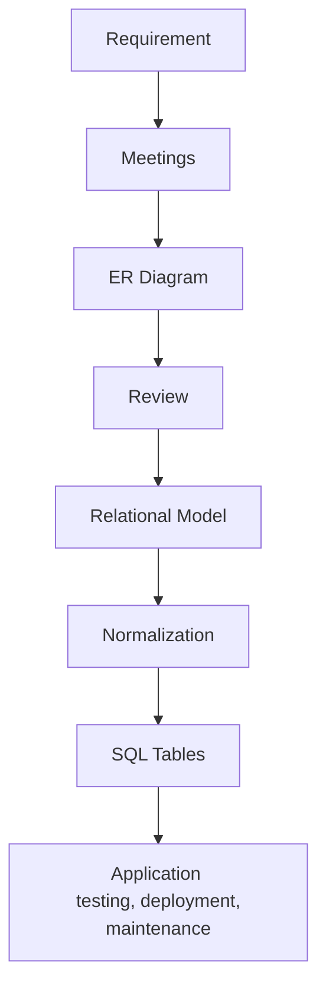

  <small><i>Authored by: Arpit Raj, LNMIIT Jaipur</i></small>
  <h1>📐 Entity Relationship Model (ER Model)</h1>
  <h2>Chapter 31</h2>

---

An **Entity Relationship Model (ER Model)** is a high-level conceptual representation of the data, entities, attributes, and relationships in a database. 

**It describes:**
- What data exists
- How data is connected
- What rules govern the data

### 🛠️ ER Modeling helps:
- Reduce redundancy
- Avoid anomalies
- Identify relationships
- Improve normalization
- Simplify implementation

---

## 🛤️ Typical Workflow

---

## 🧩 Core Components

The ER model is all about **entity, relationship, attributes, constraints**.

### Symbols Used in ER Diagrams
*(The classic Chen notation uses these symbols)*

| Symbol | Meaning |
| :--- | :--- |
| **Rectangle** | Entity |
| **Double Rectangle** | Weak Entity |
| **Diamond** | Relationship |
| **Double Diamond** | Identifying Relationship |
| **Oval** | Attribute |
| **Double Oval** | Multivalued Attribute |
| **Dashed Oval** | Derived Attribute |
| **Underlined Attribute** | Key Attribute |

---

## 🏗️ Design Phases

### 1. Conceptual Design
Primary keys and foreign keys are decided here.
**Example:**
- **Student:** StudentID, Name
- **Course:** CourseID, Title
- **Enrollment:** StudentID, CourseID

### 2. Logical Design
Now convert the conceptual model into relational structures.

### 3. Physical Design
Finally, decide how the database will be implemented. 
**Examples:**
- Data types
- Indexes
- Partitions
- Storage engine

> [!NOTE]
> SQL statements are written in this physical design phase.
