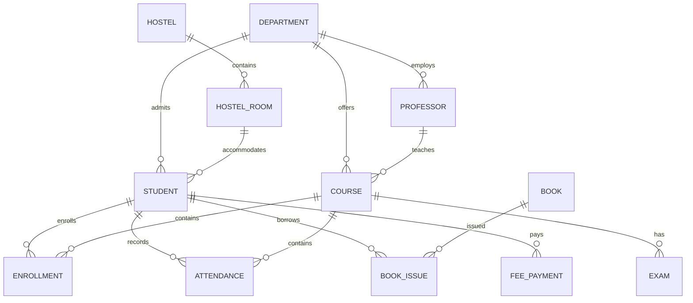

<div align="center">
  <small><i>Authored by: Arpit Raj, LNMIIT Jaipur</i></small>
  <h1>📊 ER Diagram Notation Comparison</h1>
  <h2>Chapter 39</h2>
</div>

---

There are three popular notations.

## 1️⃣ Chen Notation
Most common in universities and interviews.

**Uses:**
- **Rectangles** → Entities
- **Diamonds** → Relationships
- **Ovals** → Attributes

---

## 2️⃣ Crow's Foot Notation
Widely used in industry and database design tools.

**Uses:**
- **Boxes** for entities.
- **Lines with crow's feet** for cardinality.
- **Attributes** listed inside entity boxes.

---

## 🛠️ ER Design Methodology

Whenever you're given a paragraph in an interview, follow this order:

- **Step 1:** Read the requirements carefully.
- **Step 2:** Identify nouns. *(Likely entities)*.
- **Step 3:** Identify verbs. *(Likely relationships)*.
- **Step 4:** Identify attributes. Ask: *"What information do we store about each entity?"*
- **Step 5:** Find primary keys.
- **Step 6:** Determine cardinality.
- **Step 7:** Determine participation.
- **Step 8:** Look for:
  - Weak Entities
  - ISA
  - Aggregation
  - Recursive Relationships
- **Step 9:** Validate against business rules.

---

## 🏫 Case Study 1 — College Management System

### 1. Identify Attributes

**STUDENT**
- `StudentID` (PK)
- `RollNumber` (Unique)
- `Name`
- `DOB`
- `Gender`
- `Phone`
- `Email`
- `Address`
- `AdmissionYear`
- `Semester`
- `DepartmentID` (FK)
*(Example: StudentID: 101, Name: Aadz, Department: CSE, Semester: 5)*

**PROFESSOR**
- `ProfessorID` (PK)
- `Name`
- `Phone`
- `Email`
- `Qualification`
- `Salary`
- `DepartmentID` (FK)

**DEPARTMENT**
- `DepartmentID` (PK)
- `DepartmentName`
- `Building`
- `OfficeNumber`

**COURSE**
- `CourseID` (PK)
- `CourseCode`
- `CourseName`
- `Credits`
- `DepartmentID` (FK)

**ENROLLMENT**
- `EnrollmentID` (PK)
- `StudentID` (FK)
- `CourseID` (FK)
- `Semester`
- `Grade`

**CLASSROOM & EXAM**
- `ClassroomID` (PK), `RoomNumber`, `Building`, `Capacity`
- `ExamID` (PK), `CourseID` (FK), `ExamType`, `Date`, `MaximumMarks`

**ATTENDANCE & BOOK**
- `AttendanceID` (PK), `StudentID` (FK), `CourseID` (FK), `LectureDate`, `Status`
- `BookID` (PK), `ISBN`, `Title`, `Author`, `Publisher`, `Category`

**BOOK ISSUE** *(Weak/Associative Entity)*
- `IssueID` (PK), `BookID` (FK), `StudentID` (FK), `IssueDate`, `ReturnDate`

**HOSTEL & HOSTEL ROOM**
- `HostelID` (PK), `HostelName`, `Type`, `Capacity`
- `RoomID` (PK), `HostelID` (FK), `RoomNumber`, `Floor`, `Capacity`

**FEE PAYMENT**
- `PaymentID` (PK), `StudentID` (FK), `Amount`, `PaymentDate`, `Mode`, `Status`

---

### 2. Primary & Candidate Keys

**Primary Keys:**
| Entity | Primary Key |
| :--- | :--- |
| Student | `StudentID` |
| Professor | `ProfessorID` |
| Department | `DepartmentID` |
| Course | `CourseID` |
| Enrollment | `EnrollmentID` |
| Classroom | `ClassroomID` |
| Exam | `ExamID` |
| Attendance | `AttendanceID` |
| Book | `BookID` |
| BookIssue | `IssueID` |
| Hostel | `HostelID` |
| HostelRoom | `RoomID` |
| FeePayment | `PaymentID` |

**Candidate Keys:**
- **Student:** `StudentID`, `RollNumber`
- **Course:** `CourseID`, `CourseCode`
- **Book:** `BookID`, `ISBN`

---

### 3. Relationships & Cardinality

| Relationship | Description | Cardinality |
| :--- | :--- | :--- |
| Department → Student | Has Students | `1:N` |
| Department → Professor | Employs Professors | `1:N` |
| Department → Course | Offers Courses | `1:N` |
| Student → Enrollment | Enrolls in Course | `1:N` |
| Course → Enrollment | Enrolls in Course | `1:N` |
| Professor → Course | Teaches Course | `1:N` |
| Course → Exam | Has Exams | `1:N` |
| Student → Attendance | Takes Exam | `1:N` |
| Course → Attendance | Has Attendance | `1:N` |
| Student → BookIssue | Borrows Book | `1:N` |
| Book → BookIssue | Issued Book | `1:N` |
| Hostel → Room | Contains Rooms | `1:N` |
| Room → Student | Lives In Room | `1:N` |
| Student → FeePayment | Pays Fee | `1:N` |

---

### 4. Participation Constraints

| Relationship | Participation |
| :--- | :--- |
| Student → Department | Total |
| Department → Student | Partial |
| Professor → Department | Total |
| Department → Professor | Partial |
| Course → Department | Total |
| Department → Course | Partial |
| Enrollment → Student | Total |
| Enrollment → Course | Total |
| FeePayment → Student | Total |
| Student → FeePayment | Partial |

---

### 5. Weak Entities & Generalization

**Weak Entities:**
- `BookIssue`: Cannot exist without `Student` and `Book`. Therefore, Weak Entity.
- `HostelRoom`: Can also be modeled as weak if room numbers are unique only within a hostel.

**Generalization / Specialization:**
```text
Person
  | 
  ├── Student
  └── Professor
```
*Common attributes:* PersonID, Name, DOB, Gender, Phone, Address.
Inheritance removes duplication.

---

### 6. Complete ER Diagram in Prisma/Mermaid


