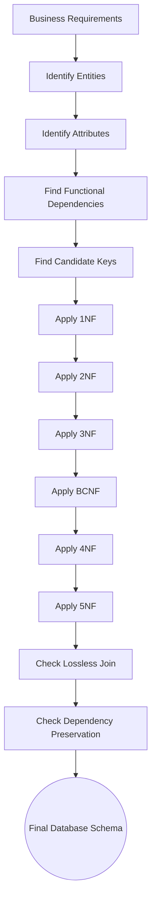

  <small><i>Authored by: Arpit Raj, LNMIIT Jaipur</i></small>
  <h1>🧹 What is Normalization?</h1>
  <h2>Chapter 47</h2>

---

## 📖 Definition

> [!NOTE]
> **Normalization** is the process of organizing data in a database to minimize redundancy, eliminate anomalies, and improve data integrity by decomposing large tables into smaller, well-structured tables.

Imagine you have one huge table storing everything:

| StudentID | StudentName | Department | HOD | Course | Grade |
| :--- | :--- | :--- | :--- | :--- | :--- |
| `101` | `aadz` | `ECE` | `Dr. Mehta` | `DSP` | `A` |
| `101` | `aadz` | `ECE` | `Dr. Mehta` | `Microprocessors` | `A` |
| `102` | `Arpit` | `ECE` | `Dr. Mehta` | `Signals & Systems` | `B` |

> [!WARNING]
> **Problems:**
> - Aadz's name repeats.
> - Department repeats.
> - HOD repeats.
> - Wasted storage.
> - Difficult to update.

**Normalization breaks this into smaller logical tables.**

### After normalization:

**Student**
| StudentID | StudentName | DepartmentID |
| :--- | :--- | :--- |
| `101` | `aadz` | `ECE` |
| `102` | `Arpit` | `ECE` |

**Department**
| DepartmentID | HOD |
| :--- | :--- |
| `ECE` | `Dr. Mehta` |

**Enrollment**
| StudentID | Course | Grade |
| :--- | :--- | :--- |
| `101` | `DSP` | `A` |
| `101` | `Microprocessors` | `A` |
| `102` | `Signals & Systems` | `B` |

> [!TIP]
> Without normalization, there are problems like redundancy, update anomaly, insertion anomaly, and deletion anomaly.

---

## 🎯 Objectives of Normalization

Normalization has several important objectives:

1. **Eliminate Redundancy**
   *Avoid storing the same information repeatedly.*
2. **Improve Data Integrity**
   *Every fact should exist in exactly one place. (Example: Department name should exist only in the Department table).*
3. **Remove Anomalies**
   *Removes update anomalies, insertion anomalies, deletion anomalies.*
4. **Maintain Consistency**
   *If one value changes, it changes only once. (Example: Changing the HOD requires updating only one row).*
5. **Better Database Design**
   *Smaller tables are easier to understand, maintain, and extend.*
6. **Reduce Storage**
   *Duplicate values are removed.*
7. **Improve Maintainability**
   *Future schema changes become simpler.*

---

## 🤔 Why Multiple Normal Forms Exist

Because each Normal Form solves a different problem.

| Form | Solves |
| :--- | :--- |
| **1NF** | Removes: Repeating groups. |
| **2NF** | Removes: Partial Dependency. |
| **3NF** | Removes: Transitive Dependency. |
| **BCNF** | Fixes situations where 3NF is still insufficient. |
| **4NF** | Removes: Multivalued Dependency. |
| **5NF** | Removes: Join Dependency. |

---

## 🛤️ Complete Workflow Diagram

---

## 📝 FAQs

<b>Is Normalization mandatory?</b>

 
<b>Answer: No.</b> 
Normalization is a design technique, not a mandatory rule.  
<b>In practice:</b> 
• <b>OLTP systems</b> (banking, e-commerce transactions, student management) are usually normalized because data consistency is critical. 
• <b>OLAP systems</b>, reporting databases, and analytics platforms often use <b>Denormalization</b> to improve query performance. 
<i>The level of normalization depends on the application's requirements.</i>

<b>Does Normalization improve performance?</b>

 
<b>Answer: It depends.</b> 
• It usually <b>improves</b> update, insert, and delete performance because data is stored only once. 
• It may <b>reduce</b> read performance because queries often require joins across multiple tables.

