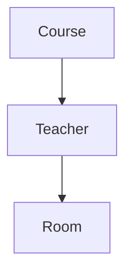

  <small><i>Authored by: Arpit Raj, LNMIIT Jaipur</i></small>
  <h1>🥉 Third Normal Form & BCNF</h1>
  <h2>Chapter 49</h2>

---

## 3️⃣ What is Third Normal Form (3NF)?

> [!NOTE]
> **Definition:** A relation is in Third Normal Form (3NF) if:
> - It is already in Second Normal Form (2NF).
> - It contains **no Transitive Dependencies**.

**Formal Definition:**
For every Functional Dependency: `X → A`
At least one must be true:
- `X` is a Super Key, OR
- `A` is a Prime Attribute *(part of some Candidate Key)*.

---

## 🛠️ Converting to 3NF

**Original Table:**
| EmployeeID | EmployeeName | DepartmentID | DepartmentName |
| :--- | :--- | :--- | :--- |

**FDs:**
- `EmployeeID → EmployeeName`
- `EmployeeID → DepartmentID`
- `DepartmentID → DepartmentName` *(This is a transitive dependency!)*

### Step 1: Identify the transitive dependency
`DepartmentID → DepartmentName`

### Step 2: Create a separate table
**Employee Table:**
| EmployeeID | EmployeeName | DepartmentID |
| :--- | :--- | :--- |

**Department Table:**
| DepartmentID | DepartmentName |
| :--- | :--- |

> [!TIP]
> Now each fact is stored only once.

---

## 🔗 Dependency Preservation

> [!NOTE]
> **Definition:** A decomposition is Dependency Preserving if all original Functional Dependencies can still be enforced without joining tables.

**If dependencies are not preserved:**
- More joins are needed to validate data.
- Updates become more expensive.

> [!WARNING]
> **3NF allows one exception:**
> A dependency is acceptable if the dependent attribute is a Prime Attribute. Sometimes this still leaves redundancy. BCNF removes this exception.

---

## 🛑 BCNF (Boyce-Codd Normal Form)

### BCNF Rule
A relation is in BCNF if:
**Every determinant is a Candidate Key.**

### Why Isn't 3NF Always Enough?
**Consider Table:**
| Teacher | Course | Room |
| :--- | :--- | :--- |

**FDs:**
- `Teacher → Room`
- `Course → Teacher`
*(Suppose each teacher has one room, and each course has one teacher).*

**Candidate Keys:** `Course`

**Since:** `Teacher → Room`
- `Teacher` is **not** a Candidate Key.
- The table **violates BCNF**.
- Yet it can satisfy 3NF depending on the key structure and prime attributes.

*Teacher determines Room but is not a Candidate Key. Violation.*

---

## ⚙️ BCNF Algorithm

1. Find Functional Dependencies.
2. Find Candidate Keys.
3. Find any FD where the determinant is not a Candidate Key.
4. Decompose the relation.
5. Repeat until every relation satisfies BCNF.

---

## ❓ BCNF sometimes loses Dependency Preservation?

> [!IMPORTANT]
> **Answer:** Yes.
> 
> BCNF focuses on removing all violations where a determinant is not a Candidate Key. During decomposition, some original Functional Dependencies may become split across multiple tables. Checking or enforcing those dependencies may require joining tables, so the decomposition is not dependency preserving.
> 
> - **3NF** is often preferred when preserving dependencies is important.
> - **BCNF** is preferred when eliminating redundancy is more important.
