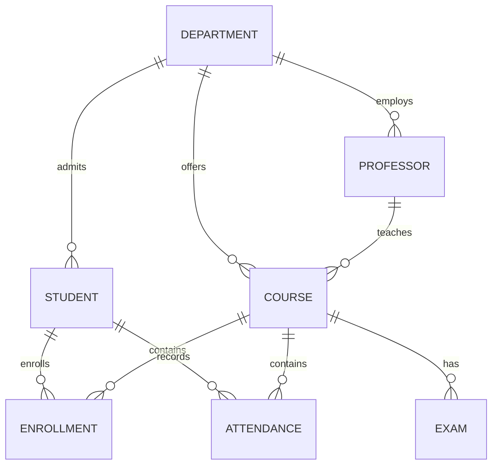

<div align="center">
  <small><i>Authored by: Arpit Raj, LNMIIT Jaipur</i></small>
  <h1>🏫 Case Study 1 — College Management System (UNF → 5NF)</h1>
  <h2>Chapter 52</h2>
</div>

---

## 🎯 Goal:
This is a complete, interview-level case study where we'll start from a poorly designed database and normalize it step by step until we reach the final schema. We'll explain every decomposition, every Functional Dependency (FD), and every decision made along the way.

## 📝 Problem Statement
A college wants to maintain information about:
- Students
- Departments
- Faculty
- Courses
- Enrollments
- Classrooms
- Semesters

The administration initially stores everything in a single spreadsheet.

---

## 🧩 Identify Entities

| Entity | Description |
| :--- | :--- |
| **Student** | Stores student information |
| **Department** | Stores department details |
| **Faculty** | Stores faculty information |
| **Course** | Stores course details |
| **Enrollment** | Student-Course relationship |
| **Classroom** | Room information |
| **Semester** | Semester details |

---

## 🧱 Initial UNF (Unnormalized Form)

Suppose the college stores data like this:

| StudentID | StudentName | Department | HOD | Phones | CourseIDs | CourseNames | Faculty |
| :--- | :--- | :--- | :--- | :--- | :--- | :--- | :--- |
| `101` | `aadz` | `ECE` | `Dr. Sharma` | `9876, 9123` | `CS301, EC204` | `DBMS, Digital Electronics` | `Dr. Rao, Gupta` |

> [!WARNING]
> **Immediately notice:**
> - Multiple phones
> - Multiple courses
> - Multiple faculty names
> - One giant table
> - Huge redundancy
> 
> *This is UNF.*

### Problems in UNF
- **Repeating Groups:** Phones, CourseIDs, CourseNames, FacultyNames
- **Redundancy:**
  - Department name repeated for every student.
  - Faculty repeated.
  - Semester repeated.
  - Room repeated.

---

## 🔍 Step 1 — Find Functional Dependencies
*This is the most important step.*

**Student FDs:**
- `StudentID → StudentName`
- `StudentID → DepartmentID`

**Department FDs:**
- `DepartmentID → DepartmentName`
- `DepartmentID → HOD`

**Course FDs:**
- `CourseID → CourseName`
- `CourseID → Credits`
- `CourseID → FacultyID`
- `CourseID → SemesterID`
- `CourseID → ClassroomID`

**Faculty FDs:**
- `FacultyID → FacultyName`
- `FacultyID → DepartmentID`

**Semester FDs:**
- `SemesterID → SemesterNumber`
- `SemesterID → AcademicYear`

**Classroom FDs:**
- `RoomID → Building`
- `RoomID → Capacity`

**Enrollment FDs:**
- `(StudentID, CourseID) → Grade`
- `(StudentID, CourseID) → Attendance`

---

## 🔑 Step 2 — Candidate Keys

| Relation | Candidate Key |
| :--- | :--- |
| **Student** | `StudentID` |
| **Department** | `DepartmentID` |
| **Faculty** | `FacultyID` |
| **Course** | `CourseID` |
| **Classroom** | `RoomID` |
| **Semester** | `SemesterID` |
| **Enrollment** | `(StudentID, CourseID)` |

---

## 🥇 Convert to First Normal Form (1NF)

**Rule:** Every attribute must be atomic.

**Original:**
| StudentID | Phones |
| :--- | :--- |
| `101` | `9876, 9123` |

**Convert:**
**StudentPhone**
| StudentID | Phone |
| :--- | :--- |
| `101` | `9876` |
| `101` | `9123` |

*Repeat for Courses & Enrollments. 1NF achieved.*

---

## 🥈 Step 4 — Convert to Second Normal Form (2NF)

2NF removes Partial Dependencies.

**Current Enrollment:**
`| StudentID | CourseID | StudentName | CourseName | FacultyName | Grade |`

**Candidate Key:** `(StudentID, CourseID)`

**Problems:**
- `StudentName` depends only on `StudentID`.
- `CourseName` depends only on `CourseID`.
- `FacultyName` depends only on `CourseID`.
- *Partial Dependencies exist.*

**Split into:**
- **Student:** `| StudentID | StudentName | DepartmentID |`
- **Course:** `| CourseID | CourseName | FacultyID |`
- **Enrollment:** `| StudentID | CourseID | Grade |`

*Now every non-prime attribute depends on the whole key. 2NF achieved.*

---

## 🥉 Convert to Third Normal Form (3NF)

**Current Student:**
`| StudentID | StudentName | DepartmentID | DepartmentName | HOD |`

`DepartmentName` and `HOD` are transitively dependent on `StudentID` (via `DepartmentID`).

**Split:**
- **Student:** `| StudentID | StudentName | DepartmentID |`
- **Department:** `| DepartmentID | DepartmentName | HOD |`

*(Repeat similarly for Faculty, Semester, Classroom, Course)*. 
*3NF achieved.*

---

## 🛑 Check BCNF

Now inspect every FD.
**Example Faculty:**
`FacultyID → FacultyName`
`FacultyID → DepartmentID`
`FacultyID` is a Candidate Key. BCNF satisfied.

*(Check Department, Course, Enrollment -> All determinants are candidate keys).*
*No BCNF decomposition required.*

---

## 🍀 Check Fourth Normal Form (4NF)

Suppose the college also stores: Student, Skills, Languages.
If `Skills` and `Languages` are independent facts, they must be separated.

**Normalize:**
- **StudentSkill:** `| StudentID | Skill |`
- **StudentLanguage:** `| StudentID | Language |`

*Now 4NF satisfied.*

---

## 🌠 Check Fifth Normal Form (5NF)

Suppose internships require: Student, Company, Project, Mentor.
If these relationships are independent and reconstructable through joins, we may decompose further. In a typical college management system, such Join Dependencies rarely exist.
*No 5NF decomposition required.*

---

## 🗄️ Final Database Schema

**Department**
```text
DepartmentID (PK)
DepartmentName
HOD
```

**Student**
```text
StudentID (PK)
StudentName
DepartmentID (FK)
```

**StudentPhone**
```text
StudentID (FK)
Phone
PK (StudentID, Phone)
```

**Faculty**
```text
FacultyID (PK)
FacultyName
DepartmentID (FK)
```

**Semester**
```text
SemesterID (PK)
SemesterNumber
AcademicYear
```

**Classroom**
```text
RoomID (PK)
Building
Capacity
```

**Course**
```text
CourseID (PK)
CourseName
Credits
FacultyID (FK)
SemesterID (FK)
RoomID (FK)
```

**Enrollment**
```text
StudentID (FK)
CourseID (FK)
Grade
Attendance
PK (StudentID, CourseID)
```

*(Plus StudentSkill, StudentLanguage as identified in 4NF).*

---

## 🗺️ Final ER-style Relationship Overview



### SQL Table Creation (Snippet)
```sql
CREATE TABLE Department (
 DepartmentID INT PRIMARY KEY,
 DepartmentName VARCHAR(100),
 HOD VARCHAR(100)
);

CREATE TABLE Student (
 StudentID INT PRIMARY KEY,
 StudentName VARCHAR(100),
 DepartmentID INT,
 FOREIGN KEY (DepartmentID) REFERENCES Department(DepartmentID)
);
```

---

## 📊 Final Normalization Status

| Normal Form | Status | Reason |
| :--- | :--- | :--- |
| **1NF** | ✅ | All attributes are atomic; no repeating groups. |
| **2NF** | ✅ | No Partial Dependencies remain. |
| **3NF** | ✅ | No Transitive Dependencies remain. |
| **BCNF**| ✅ | Every determinant is a Candidate Key. |
| **4NF** | ✅ | Independent multivalued facts (skills, languages) are separated. |
| **5NF** | ✅ | No non-trivial Join Dependencies exist in the design. |
